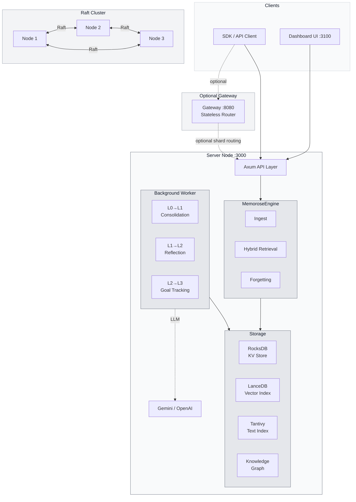
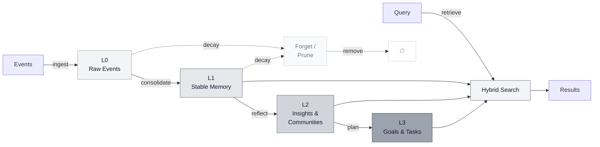

# Architecture Overview

Memorose is a memory runtime for agents. The system ingests raw events, consolidates them into durable memory, derives higher-order insights, tracks goal execution, and exposes all of that through a Rust server, a dashboard, and optional gateway plus Raft-backed deployment primitives.

## System Architecture



## Data Flow



## Workspace Shape

```text
crates/
├── memorose-common    # shared config, core types, task and graph models
├── memorose-core      # engine, storage, retrieval, graph, organization knowledge
├── memorose-server    # Axum API, dashboard auth, management routes
└── memorose-gateway   # optional stateless shard router
```

## Runtime Pipeline

1. Events arrive on `/v1/users/:user_id/streams/:stream_id/events`
2. L0 raw events are stored and queued for consolidation
3. Consolidation produces L1 memory units
4. Reflection and graph/community analysis produce L2 insights
5. L3 goal and task memory coordinates future work and execution state
6. Retrieval merges vector, text, graph, and shared-knowledge signals
7. Forgetting prunes or compacts low-value memory over time

## Key Product Concepts

### L0-L3

Memorose uses an explicit memory hierarchy:

- `L0`: raw event stream
- `L1`: stable facts and procedural traces
- `L2`: themes, clusters, reflective summaries, and shared insights
- `L3`: goal structures, task trees, milestones, dependencies, and execution status

### Domains

The ownership and sharing model is:

- `agent`: how a specific agent learns to operate
- `user`: who the user is and what they prefer
- `organization`: reusable shared knowledge projected from authorized source memory

### Streams

Every ingest and retrieval request is scoped to a `stream_id`. Streams preserve session-local chronology while still feeding long-lived memory.

## Storage Model

Memorose combines several storage engines instead of pushing everything into one system:

- RocksDB for local durable state and key-value access
- Lance for embeddings and vector retrieval
- Tantivy for text retrieval
- Graph and organization-knowledge views built on top of those primitives

## Retrieval Model

Retrieval is hybrid by design. Queries can combine:

- semantic similarity
- text search
- graph depth expansion
- time filters
- organization knowledge
- optional multimodal embedding input

## Deployment Model

- Single-node mode for local development
- Raft-based clustering for replicated deployment
- Sharded topologies for larger installations
- Optional gateway routing layer for some deployments
- Separate dashboard UI on port `3100`

This is infrastructure software first. The docs should be read with that model in mind.
