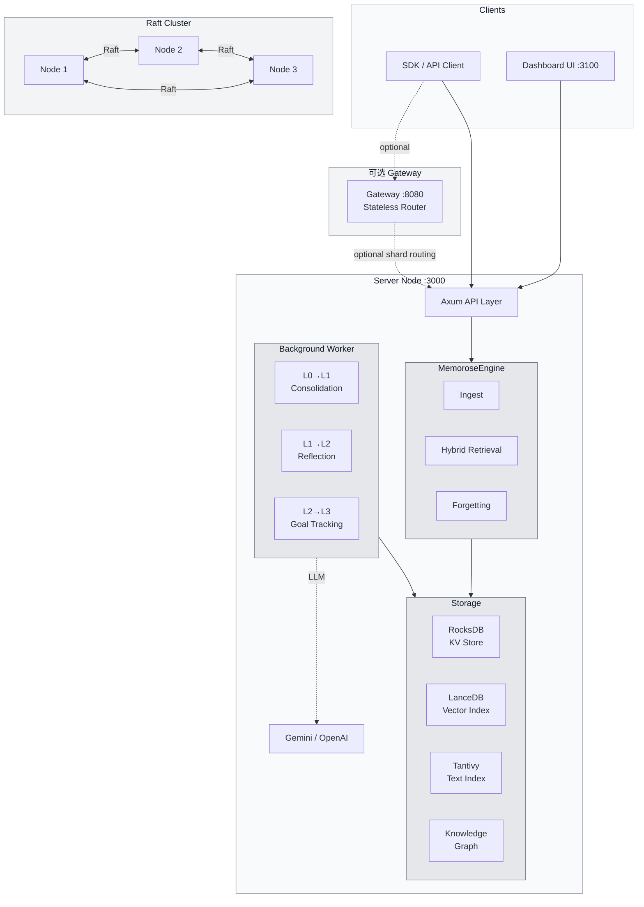
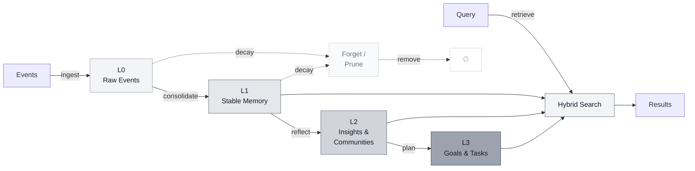

# 架构概览

Memorose 是一个面向智能体（Agent）的记忆运行时（Memory Runtime）。系统接收原始事件，将其整合为持久化记忆，推导出高阶洞察（Insight），追踪目标执行状态，并通过 Rust 服务端、仪表盘（Dashboard）以及可选 gateway 与基于 Raft 的部署原语对外暴露所有能力。

## 系统架构



## 数据流



## 工作区结构

```text
crates/
├── memorose-common    # shared config, core types, task and graph models
├── memorose-core      # engine, storage, retrieval, graph, organization knowledge
├── memorose-server    # Axum API, dashboard auth, management routes
└── memorose-gateway   # 可选的无状态分片路由器
```

## 运行时管道

1. 事件通过 `/v1/users/:user_id/streams/:stream_id/events` 到达
2. L0 原始事件被存储并排入整合（Consolidation）队列
3. 整合过程生成 L1 记忆单元（Memory Unit）
4. 反思（Reflection）与图/社区分析生成 L2 洞察
5. L3 目标与任务记忆协调后续工作和执行状态
6. 检索（Retrieval）融合向量、文本、图谱和共享知识信号
7. 遗忘（Forgetting）随时间修剪或压缩低价值记忆

## 核心产品概念

### L0-L3

Memorose 使用显式的记忆层级（Memory Hierarchy）：

- `L0`：原始事件流（Raw Event Stream）
- `L1`：稳定的事实与过程性痕迹（Procedural Traces）
- `L2`：主题、聚类、反思性摘要与共享洞察
- `L3`：目标结构、任务树、里程碑、依赖关系与执行状态

### 领域

所有权与共享模型如下：

- `agent`：特定智能体如何学习操作
- `user`：用户是谁以及他们的偏好
- `organization`：从授权源记忆中投射出的可复用共享知识

### 流（Streams）

每个摄入和检索请求都限定在一个 `stream_id` 范围内。流保留会话级别的时间顺序，同时仍然为长期记忆提供数据。

## 存储模型

Memorose 组合了多个存储引擎（Storage Engine），而非将所有内容推入单一系统：

- RocksDB 用于本地持久化状态和键值访问
- Lance 用于嵌入向量（Embedding）和向量检索
- Tantivy 用于文本检索
- 图谱（Graph）和组织知识视图构建在上述原语之上

## 检索模型

检索在设计上就是混合的（Hybrid）。查询可以组合：

- 语义相似度（Semantic Similarity）
- 文本搜索
- 图谱深度扩展
- 时间过滤
- 组织知识
- 可选的多模态嵌入输入（Multimodal Embedding）

## 部署模型

- 单节点模式用于本地开发
- 基于 Raft 的集群用于复制部署
- 分片拓扑（Sharded Topologies）用于更大规模的安装
- 某些部署场景下可选的 gateway 路由层
- 独立的仪表盘 UI 运行在端口 `3100`

这首先是基础设施软件。文档应以此模型为前提来阅读。
